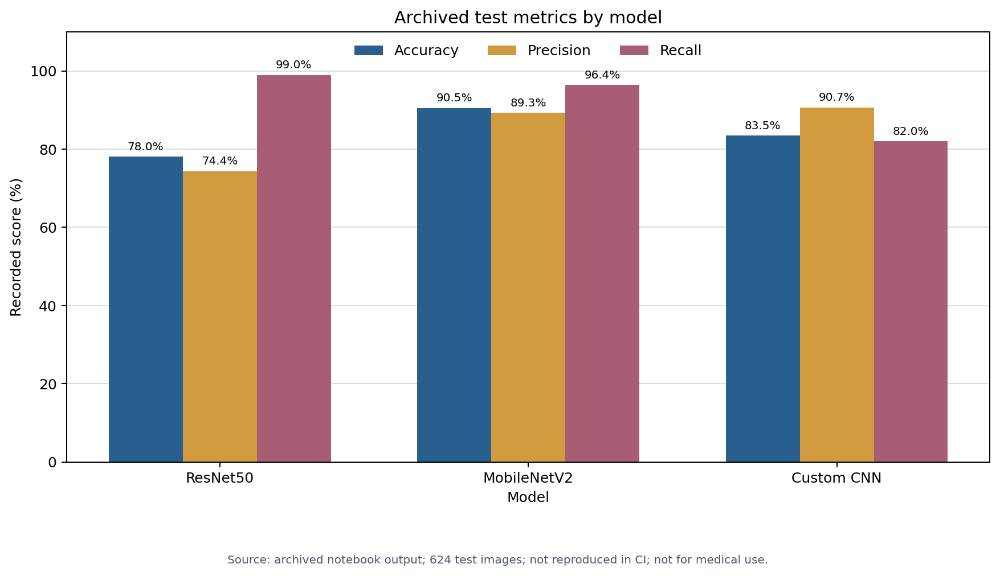

# Pneumonia Notebook Validation Report

## Technical summary

The repository demonstrates a useful academic model-comparison workflow, but it does not currently contain enough evidence for independent reproduction or any medical-use claim. The former README also contradicted the notebook's recorded test output. This revision treats the notebook output as an archived experiment log, publishes only the three directly inspectable metrics, and removes unsupported clinical, regulatory, production, AUC, and deployment statements.

## Key finding

The archived output identifies MobileNetV2 as the strongest of the three recorded runs by test accuracy. That is an experiment-specific comparison, not evidence of clinical utility.

| Model | Accuracy | Precision | Recall | Threshold | Evidence status |
| --- | ---: | ---: | ---: | ---: | --- |
| ResNet50 | 78.04% | 74.37% | 98.97% | 0.50 | Archived notebook output |
| MobileNetV2 | 90.54% | 89.31% | 96.41% | 0.50 | Archived notebook output |
| Custom CNN | 83.49% | 90.65% | 82.05% | 0.35 | Archived notebook output |

All metrics refer to the notebook's 624-image test generator. They were not independently rerun during this review.

## Scope, data, and definitions

- Reviewed: source modules, notebook code and saved text output, README, and legacy result-summary material.
- Not available: raw image files, trained model weights, run environment lock, model hashes, prediction files, or patient identifiers.
- Positive class: `PNEUMONIA`.
- Accuracy: share of all predictions matching the folder label.
- Precision: share of predicted-positive images whose folder label is positive.
- Recall: share of positive-labelled images predicted positive.
- Validation design: an 80/20 seeded split of the dataset's training folder. The separate 16-image `val` folder is not used for training decisions.

## Methodology

1. Inspected every repository file and the notebook's executable cells.
2. Compared README claims against the notebook's archived stream output.
3. Preserved only the exact accuracy, precision, recall, threshold, and test-size values shown in that output.
4. Removed AUC and higher performance figures that were not supported by the same inspectable output.
5. Cleared stale notebook outputs and replaced machine-specific paths with repository configuration.
6. Added automated checks for notebook portability, metric provenance, syntax, and prohibited claim language.

## Limitations, uncertainty, and robustness

- **Not reproducible from this repository alone:** the dataset and model artefacts are absent.
- **Patient leakage is unknown:** no patient identifiers or patient-grouped split audit are available.
- **Duplicate leakage is unknown:** no exact or perceptual hash audit was recorded.
- **Generalisation is unknown:** there is no external site, device, age-group, or demographic evaluation.
- **Threshold selection may be optimistic:** the custom CNN uses 0.35 while the transfer models use 0.50; the selection protocol is not documented as nested or preregistered.
- **No uncertainty estimates:** confidence intervals and repeated-seed variability were not calculated.
- **No calibration evidence:** model scores must not be interpreted as probabilities of disease.
- **Label quality is inherited:** folder labels and any dataset-specific biases were not independently adjudicated.
- **No clinical study:** the experiment has no workflow, safety, human-factors, prospective, or regulatory validation.

## Next steps

1. Create a versioned data manifest with dataset version, file hashes, counts, and licences.
2. Audit exact duplicates, near duplicates, and patient-level overlap before training.
3. Export per-image predictions, labels, thresholds, and model hashes for every run.
4. Lock the software environment and record seeds, hardware, and training configuration.
5. Use patient-grouped cross-validation and report repeated-run confidence intervals.
6. Reserve a genuinely external dataset for generalisation testing.
7. Add calibration, subgroup, and error analyses before discussing practical use.

## Further questions

- Can the original model files and prediction arrays be recovered with hashes?
- Does the source dataset expose patient identifiers needed for grouped splitting?
- How were the decision thresholds selected, and were test labels consulted?
- Can the experiment be repeated across multiple seeds and an external dataset?

## Provenance

Canonical source: `Pnuemonia_detection_project.ipynb`, archived Cell 8 stream output in the repository version reviewed on 16 August 2026. Machine-readable transcription: `results/reported_metrics.json`.
